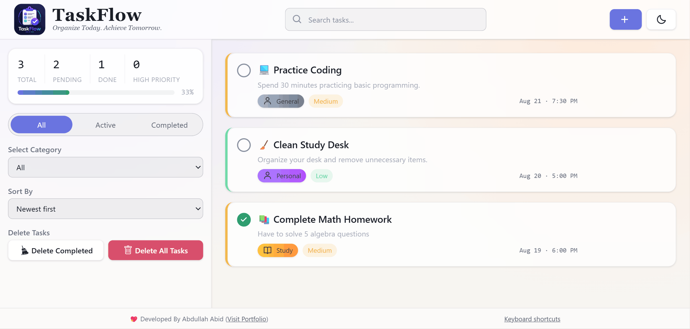
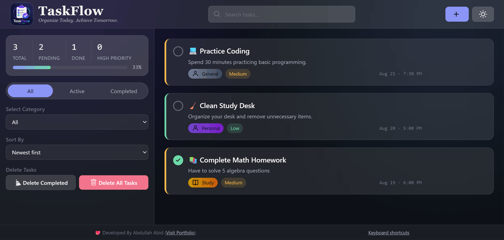

# ✅ TaskFlow - ToDo List App

> **Organize Today. Achieve Tomorrow.**

TaskFlow is a modern and responsive task management application built with **React, Vite, and Tailwind CSS**.

It allows users to create, organize, manage, and track their daily tasks with features such as priorities, categories, due dates, search, filtering, sorting, favorites, pinning, statistics, dark/light mode, and local storage persistence.

---

## 📸 Preview

### Light Mode



### Dark Mode



---

## ✨ Features

- ✅ Add new tasks
- 📝 Add task notes
- 🏷️ Assign task categories
- 🚩 Set task priority
- 📅 Add due dates
- ⏰ Add due times
- ✔️ Mark tasks as completed/incomplete
- ⭐ Mark tasks as favorite
- 📌 Pin tasks to the top
- ✏️ Edit existing tasks
- 🗑️ Delete individual tasks
- 🗑️ Bulk delete completed tasks
- 🔍 Search tasks by text
- 🔎 Filter tasks by:
  - All
  - Active
  - Completed
- 🏷️ Filter tasks by category
- ↕️ Sort tasks by:
  - Newest
  - Oldest
  - A → Z
  - Z → A
- 📊 Task statistics:
  - Total tasks
  - Pending tasks
  - Completed tasks
  - High-priority tasks
  - Progress percentage
- 🌙 Dark/Light theme
- 💾 Local Storage persistence
- 🔔 Toast notifications
- ⌨️ Keyboard shortcuts
- 📱 Responsive design
- 🪟 Custom modals
- ✨ Smooth UI animations
- 🎨 Modern glassmorphism-inspired interface
- ♿ Accessible interactive elements

---

## 🛠️ Built With

- **React**
- **Vite**
- **Tailwind CSS**
- **JavaScript (ES6+)**
- **React Icons**
- **Local Storage API**

---

## 📂 Project Structure

```text
TaskFlow-ToDo-List_App/
│
├── public/
│   └── ...
│
├── src/
│   ├── components/
│   │   ├── common/
│   │   ├── layout/
│   │   ├── modals/
│   │   ├── tasks/
│   │   └── toolbars/
│   │
│   ├── constants/
│   │
│   ├── hooks/
│   │   ├── useConfirm.js
│   │   ├── useTaskFilters.js
│   │   ├── useTasks.js
│   │   ├── useTheme.js
│   │   └── useToast.js
│   │
│   ├── utils/
│   │
│   ├── App.jsx
│   ├── index.css
│   └── main.jsx
│
├── .gitignore
├── index.html
├── LICENSE
├── package.json
├── package-lock.json
└── README.md
```

---

## 🚀 Getting Started

### 1. Clone the repository
```bash
git clone https://github.com/Abdullah-18155/TaskFlow-ToDo-List_App.git
```

### 2. Navigate to the project
```bash
cd TaskFlow-ToDo-List_App
```

### 3. Install dependencies
```bash
npm install
```

### 4. Start the development server
```bash
npm run dev
```

Open the local development URL shown in your terminal.

---

## 📦 Build for Production

Create a production build:
```bash
npm run build
```
Preview the production build locally:
```bash
npm run preview
```

---

## 💾 Data Persistence

TaskFlow uses the browser's **Local Storage API** to save tasks.

This means:

- Tasks remain available after refreshing the page.
- No backend or database is required.
- Task data is stored locally in the user's browser.

Clearing the browser's Local Storage will remove the saved tasks.

---

## 📱 Responsive Design

TaskFlow is designed to provide a consistent experience across:

- 📱 Mobile
- 📱 Tablet
- 💻 Desktop

The interface adapts its layout and controls according to the available screen size.

---

## ⌨️ Keyboard Shortcuts

TaskFlow includes keyboard shortcuts to make task management faster.

Open the **Keyboard Shortcuts** section inside the application to view the available shortcuts.

---

## 👨‍💻 Author

**Hafiz Abdullah Abid**

Frontend Developer focused on building modern and responsive web applications using React, Next.js, JavaScript, Tailwind CSS, and modern frontend technologies.

If you like this project, consider giving the repository a ⭐.

---

## 📄 License

This project is licensed under the MIT License.
